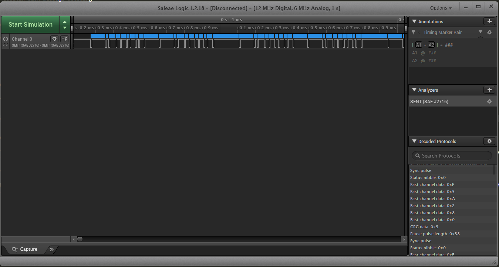
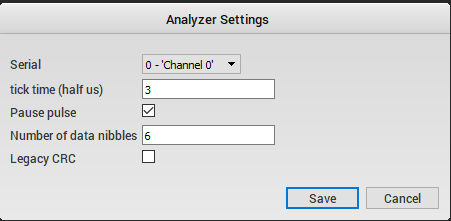

# SENT (SAE J2716) Analyzer for Saleae USB logic analyzer

This plugin allows decoding SENT frames of up to 6 data nibbles and allows exporting the nibble data for further postprocessing

## Wishlist:

- Builtin slow message decoding
- Automatic detection of tick time
- SPC support
- Aggregation of individual nibble data into into FC1/FC2 data --> Loads of different configurations, could get complex

## Building the plugin:

If you're just here to grab the latest copy of the analyzer, the easiest option would be to grab the build artifacts from
the results of the CI pipeline. If you'd like to make modifications or are convinced you can build it better, keep reading:

### MacOS

Dependencies:
- XCode with command line tools
- CMake 3.11+

Installing command line tools after XCode is installed:
```
xcode-select --install
```

Then open XCode, open Preferences from the main menu, go to locations, and select the only option under 'Command line tools'.

Installing CMake on MacOS:

1. Download the binary distribution for MacOS, `cmake-*-Darwin-x86_64.dmg`
2. Install the usual way by dragging into applications.
3. Open a terminal and run the following:
```
/Applications/CMake.app/Contents/bin/cmake-gui --install
```
*Note: Errors may occur if older versions of CMake are installed.*

Building the analyzer:
```
mkdir build
cd build
cmake ..
cmake --build .
```

### Ubuntu 16.04

Dependencies:
- CMake 3.11+
- gcc 4.8+

Misc dependencies:

```
sudo apt-get install build-essential
```

Building the analyzer:
```
mkdir build
cd build
cmake ..
cmake --build .
```

### Windows

Dependencies:
- Visual Studio 2015 Update 3
- CMake 3.11+

**Visual Studio 2015**

*Note - newer versions of Visual Studio should be fine.*

Setup options:
- Programming Languages > Visual C++ > select all sub-components.

Note - if CMake has any problems with the MSVC compiler, it's likely a component is missing.

**CMake**

Download and install the latest CMake release here.
https://cmake.org/download/

Building the analyzer:
```
mkdir build
cd build
cmake ..
```

Then, open the newly created solution file located here: `build\SENT_analyzer.sln`

## Installing the plugin:

Copy the .dll/.so over to the Saleae Logic analyzer folder. You can either copy it to the "Analyzers" folder in the Saleae Logic installation directory, or specify a custom path under "Preferences --> Developer"

## Testing the installation:

When installed, the plugin can be tested (in the absence of an actual SENT signal) by loading the analyzer (it should show up in the list now) and hitting the "Start simulation" button. Note that for this to work, the Saleae Logic analyzer should not be connected to the computer.



## Configuring the plugin:

The plugin can be configured in a number of ways to support various SENT configurations.



- Serial: Used to select which input channel contains the SENT signal
- tick time (half us): The tick time of the SENT signal. Due to some limitations of the saleae plugin framework, decimal numbers are not supported. #
  Therefore, the unit used here is "half us", i.e. for a 1.5us tick time the value entered here should be 3
- Pause pulse: Select whether or not the SENT frame contains a pause pulse or not
- Number of data nibbles: Well, the number of data nibbles
- Legacy CRC: Select whether the CRC algorithm used is the legacy algorithm or the newer, more secure one.

## Export format:

The plugin supports exporting the SENT data in csv format for further processing (slow message) or for automation purposes.

At the moment, the output format looks like this:

```
0.000656750000000, 0x38, SYNC_PULSE
0.000740750000000, 0x00, STATUS_NIBBLE
0.000758750000000, 0x0F, FC_NIBBLE
0.000799250000000, 0x05, FC_NIBBLE
0.000824750000000, 0x0A, FC_NIBBLE
0.000857750000000, 0x02, FC_NIBBLE
0.000878750000000, 0x08, FC_NIBBLE
0.000908750000000, 0x00, FC_NIBBLE
0.000926750000000, 0x09, CRC_NIBBLE
0.000958250000000, 0x64, PAUSE_PULSE
------, ------, -----
0.001108250000000, 0x38, SYNC_PULSE
0.001192250000000, 0x00, STATUS_NIBBLE
0.001210250000000, 0x0F, FC_NIBBLE
0.001250750000000, 0x05, FC_NIBBLE
0.001276250000000, 0x0A, FC_NIBBLE
0.001309250000000, 0x02, FC_NIBBLE
0.001330250000000, 0x08, FC_NIBBLE
0.001360250000000, 0x00, FC_NIBBLE
0.001378250000000, 0x09, CRC_NIBBLE
0.001409750000000, 0x38, PAUSE_PULSE
------, ------, -----
0.001493750000000, 0x38, SYNC_PULSE
0.001577750000000, 0x00, STATUS_NIBBLE
0.001595750000000, 0x0F, FC_NIBBLE
0.001636250000000, 0x05, FC_NIBBLE
0.001661750000000, 0x0A, FC_NIBBLE
0.001694750000000, 0x02, FC_NIBBLE
0.001715750000000, 0x08, FC_NIBBLE
0.001745750000000, 0x00, FC_NIBBLE
0.001763750000000, 0x09, CRC_NIBBLE
0.001795250000000, 0x64, PAUSE_PULSE
```

Note that more formats will likely be added, as the format shown above does not allow for the fastest data processing. We will likely add a format that groups the
for a single SENT frame on a single line (with a timestamp for the beginning of the SENT message)

